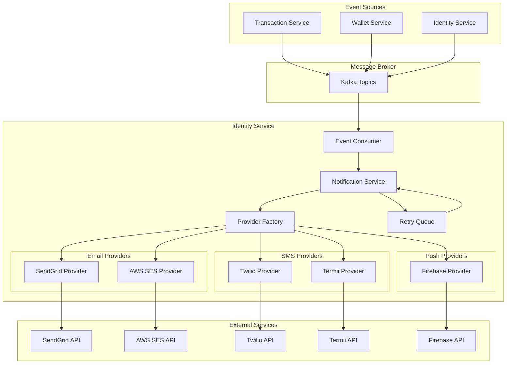

# Design Document: Notification Provider Integration

## Overview

This design extends the existing notification infrastructure in the identity-service to support production-ready notification delivery through external providers. The architecture follows the adapter pattern already established with the `PushProvider`, `EmailProvider`, and `SMSProvider` interfaces, adding concrete implementations for SendGrid, AWS SES, Twilio, Termii, and Firebase Cloud Messaging.

The design also introduces an event consumer that listens to platform events via Kafka and automatically triggers notifications based on event types, respecting user preferences and using the template system already in place.

## Architecture



## Components and Interfaces

### Provider Interfaces (Existing)

The existing interfaces in `notificationService.ts` will be extended:

```typescript
// Existing interface - no changes needed
export interface EmailProvider {
  name: string;
  send(to: string, subject: string, body: string, html?: string): Promise<boolean>;
}

// Extended interface for delivery tracking
export interface EmailProviderExtended extends EmailProvider {
  sendWithTracking(
    to: string,
    subject: string,
    body: string,
    html?: string,
    metadata?: { notificationId: string }
  ): Promise<EmailDeliveryResult>;
}

export interface EmailDeliveryResult {
  success: boolean;
  messageId?: string;
  error?: string;
  errorCode?: string;
}

// Existing interface - no changes needed
export interface SMSProvider {
  name: string;
  send(phone: string, message: string): Promise<boolean>;
}

// Extended interface for delivery tracking
export interface SMSProviderExtended extends SMSProvider {
  sendWithTracking(
    phone: string,
    message: string,
    metadata?: { notificationId: string }
  ): Promise<SMSDeliveryResult>;
}

export interface SMSDeliveryResult {
  success: boolean;
  messageId?: string;
  segments?: number;
  error?: string;
  errorCode?: string;
}

// Existing interface - no changes needed
export interface PushProvider {
  name: string;
  send(token: string, title: string, body: string, data?: Record<string, unknown>): Promise<boolean>;
}

// Extended interface for batch sending
export interface PushProviderExtended extends PushProvider {
  sendBatch(
    tokens: string[],
    title: string,
    body: string,
    data?: Record<string, unknown>
  ): Promise<PushBatchResult>;
}

export interface PushBatchResult {
  successCount: number;
  failureCount: number;
  invalidTokens: string[];
  errors: Array<{ token: string; error: string }>;
}
```

### SendGrid Email Provider

```typescript
// src/providers/email/SendGridProvider.ts
import sgMail from '@sendgrid/mail';

export class SendGridProvider implements EmailProviderExtended {
  name = 'sendgrid';
  
  constructor(private config: {
    apiKey: string;
    fromEmail: string;
    fromName: string;
    replyTo?: string;
  }) {
    sgMail.setApiKey(config.apiKey);
  }

  async send(to: string, subject: string, body: string, html?: string): Promise<boolean> {
    const result = await this.sendWithTracking(to, subject, body, html);
    return result.success;
  }

  async sendWithTracking(
    to: string,
    subject: string,
    body: string,
    html?: string,
    metadata?: { notificationId: string }
  ): Promise<EmailDeliveryResult> {
    // Implementation details in tasks
  }
}
```

### AWS SES Email Provider

```typescript
// src/providers/email/SESProvider.ts
import { SESClient, SendEmailCommand } from '@aws-sdk/client-ses';

export class SESProvider implements EmailProviderExtended {
  name = 'ses';
  private client: SESClient;
  
  constructor(private config: {
    region: string;
    accessKeyId: string;
    secretAccessKey: string;
    fromEmail: string;
    fromName: string;
  }) {
    this.client = new SESClient({
      region: config.region,
      credentials: {
        accessKeyId: config.accessKeyId,
        secretAccessKey: config.secretAccessKey,
      },
    });
  }

  async send(to: string, subject: string, body: string, html?: string): Promise<boolean> {
    const result = await this.sendWithTracking(to, subject, body, html);
    return result.success;
  }

  async sendWithTracking(
    to: string,
    subject: string,
    body: string,
    html?: string,
    metadata?: { notificationId: string }
  ): Promise<EmailDeliveryResult> {
    // Implementation details in tasks
  }
}
```

### Twilio SMS Provider

```typescript
// src/providers/sms/TwilioProvider.ts
import twilio from 'twilio';

export class TwilioProvider implements SMSProviderExtended {
  name = 'twilio';
  private client: twilio.Twilio;
  
  constructor(private config: {
    accountSid: string;
    authToken: string;
    fromNumber: string;
  }) {
    this.client = twilio(config.accountSid, config.authToken);
  }

  async send(phone: string, message: string): Promise<boolean> {
    const result = await this.sendWithTracking(phone, message);
    return result.success;
  }

  async sendWithTracking(
    phone: string,
    message: string,
    metadata?: { notificationId: string }
  ): Promise<SMSDeliveryResult> {
    // Implementation details in tasks
  }
}
```

### Termii SMS Provider

```typescript
// src/providers/sms/TermiiProvider.ts
import axios from 'axios';

export class TermiiProvider implements SMSProviderExtended {
  name = 'termii';
  private baseUrl = 'https://api.ng.termii.com/api';
  
  constructor(private config: {
    apiKey: string;
    senderId: string;
    channel?: 'generic' | 'dnd' | 'whatsapp';
  }) {}

  async send(phone: string, message: string): Promise<boolean> {
    const result = await this.sendWithTracking(phone, message);
    return result.success;
  }

  async sendWithTracking(
    phone: string,
    message: string,
    metadata?: { notificationId: string }
  ): Promise<SMSDeliveryResult> {
    // Implementation details in tasks
  }
}
```

### Firebase Push Provider

```typescript
// src/providers/push/FirebaseProvider.ts
import * as admin from 'firebase-admin';

export class FirebaseProvider implements PushProviderExtended {
  name = 'firebase';
  
  constructor(private config: {
    projectId: string;
    privateKey: string;
    clientEmail: string;
  }) {
    if (!admin.apps.length) {
      admin.initializeApp({
        credential: admin.credential.cert({
          projectId: config.projectId,
          privateKey: config.privateKey.replace(/\\n/g, '\n'),
          clientEmail: config.clientEmail,
        }),
      });
    }
  }

  async send(
    token: string,
    title: string,
    body: string,
    data?: Record<string, unknown>
  ): Promise<boolean> {
    const result = await this.sendBatch([token], title, body, data);
    return result.successCount > 0;
  }

  async sendBatch(
    tokens: string[],
    title: string,
    body: string,
    data?: Record<string, unknown>
  ): Promise<PushBatchResult> {
    // Implementation details in tasks
  }
}
```

### Provider Factory

```typescript
// src/providers/ProviderFactory.ts
export class NotificationProviderFactory {
  private static emailProvider: EmailProvider | null = null;
  private static smsProvider: SMSProvider | null = null;
  private static pushProvider: PushProvider | null = null;

  static getEmailProvider(): EmailProvider {
    if (!this.emailProvider) {
      this.emailProvider = this.createEmailProvider();
    }
    return this.emailProvider;
  }

  static getSMSProvider(): SMSProvider {
    if (!this.smsProvider) {
      this.smsProvider = this.createSMSProvider();
    }
    return this.smsProvider;
  }

  static getPushProvider(): PushProvider {
    if (!this.pushProvider) {
      this.pushProvider = this.createPushProvider();
    }
    return this.pushProvider;
  }

  private static createEmailProvider(): EmailProvider {
    const provider = process.env.EMAIL_PROVIDER;
    
    switch (provider) {
      case 'sendgrid':
        return new SendGridProvider({
          apiKey: process.env.SENDGRID_API_KEY!,
          fromEmail: process.env.EMAIL_FROM_ADDRESS!,
          fromName: process.env.EMAIL_FROM_NAME!,
          replyTo: process.env.EMAIL_REPLY_TO,
        });
      case 'ses':
        return new SESProvider({
          region: process.env.AWS_REGION!,
          accessKeyId: process.env.AWS_ACCESS_KEY_ID!,
          secretAccessKey: process.env.AWS_SECRET_ACCESS_KEY!,
          fromEmail: process.env.EMAIL_FROM_ADDRESS!,
          fromName: process.env.EMAIL_FROM_NAME!,
        });
      default:
        logger.warn('No email provider configured, using stub');
        return new StubEmailProvider();
    }
  }

  private static createSMSProvider(): SMSProvider {
    const provider = process.env.SMS_PROVIDER;
    
    switch (provider) {
      case 'twilio':
        return new TwilioProvider({
          accountSid: process.env.TWILIO_ACCOUNT_SID!,
          authToken: process.env.TWILIO_AUTH_TOKEN!,
          fromNumber: process.env.TWILIO_FROM_NUMBER!,
        });
      case 'termii':
        return new TermiiProvider({
          apiKey: process.env.TERMII_API_KEY!,
          senderId: process.env.TERMII_SENDER_ID!,
          channel: process.env.TERMII_CHANNEL as 'generic' | 'dnd' | 'whatsapp',
        });
      default:
        logger.warn('No SMS provider configured, using stub');
        return new StubSMSProvider();
    }
  }

  private static createPushProvider(): PushProvider {
    const provider = process.env.PUSH_PROVIDER;
    
    switch (provider) {
      case 'firebase':
        return new FirebaseProvider({
          projectId: process.env.FIREBASE_PROJECT_ID!,
          privateKey: process.env.FIREBASE_PRIVATE_KEY!,
          clientEmail: process.env.FIREBASE_CLIENT_EMAIL!,
        });
      default:
        logger.warn('No push provider configured, using stub');
        return new StubPushProvider();
    }
  }

  static validateConfiguration(): ConfigValidationResult {
    // Validates all required env vars are present
  }
}
```

### Event Consumer

```typescript
// src/consumers/NotificationEventConsumer.ts
import { EventConsumer, Topics, EventTypes } from '@platform/common-events';

export class NotificationEventConsumer {
  private consumer: EventConsumer;
  private notificationService: NotificationService;

  constructor(notificationService: NotificationService) {
    this.notificationService = notificationService;
    this.consumer = new EventConsumer({
      groupId: 'notification-service',
      topics: [
        Topics.TRANSACTION,
        Topics.WALLET,
        Topics.IDENTITY,
      ],
    });
  }

  async start(): Promise<void> {
    await this.consumer.subscribe(this.handleEvent.bind(this));
  }

  private async handleEvent(event: PlatformEvent): Promise<void> {
    try {
      switch (event.type) {
        case EventTypes.TRANSACTION_COMPLETED:
          await this.handleTransactionCompleted(event.payload);
          break;
        case EventTypes.TRANSACTION_FAILED:
          await this.handleTransactionFailed(event.payload);
          break;
        case EventTypes.WALLET_CREDITED:
          await this.handleWalletCredited(event.payload);
          break;
        case EventTypes.WALLET_DEBITED:
          await this.handleWalletDebited(event.payload);
          break;
        case EventTypes.USER_LOGIN:
          await this.handleUserLogin(event.payload);
          break;
        // Additional event handlers
      }
    } catch (error) {
      logger.error('Event processing failed', { eventType: event.type, error });
      // Continue processing other events
    }
  }

  private async handleTransactionCompleted(payload: TransactionCompletedEvent): Promise<void> {
    await this.notificationService.sendFromTemplate(
      payload.userId,
      'transaction_debit',
      {
        currency: payload.currency,
        amount: payload.amount.toString(),
        reference: payload.referenceNumber,
        recipient: payload.destinationAccount || 'wallet',
      }
    );
  }

  // Additional handlers...
}
```

### Retry Queue

```typescript
// src/services/RetryQueueService.ts
export class RetryQueueService {
  private readonly MAX_RETRIES = 3;
  private readonly RETRY_DELAYS = [60000, 300000, 900000]; // 1min, 5min, 15min

  async scheduleRetry(
    notificationId: string,
    channel: 'email' | 'sms' | 'push',
    retryCount: number
  ): Promise<void> {
    if (retryCount >= this.MAX_RETRIES) {
      await this.markPermanentlyFailed(notificationId, channel);
      return;
    }

    const delay = this.RETRY_DELAYS[retryCount];
    const scheduledAt = new Date(Date.now() + delay);

    await this.db.query(
      `INSERT INTO notification_retries (notification_id, channel, retry_count, scheduled_at)
       VALUES ($1, $2, $3, $4)`,
      [notificationId, channel, retryCount + 1, scheduledAt]
    );
  }

  async processRetries(): Promise<void> {
    const pendingRetries = await this.db.query(
      `SELECT * FROM notification_retries 
       WHERE scheduled_at <= NOW() AND processed = FALSE
       ORDER BY scheduled_at ASC
       LIMIT 100`
    );

    for (const retry of pendingRetries.rows) {
      await this.processRetry(retry);
    }
  }

  private async processRetry(retry: NotificationRetry): Promise<void> {
    // Re-attempt delivery through appropriate channel
  }
}
```

## Data Models

### New Database Tables

```sql
-- Notification retry queue
CREATE TABLE IF NOT EXISTS notification_retries (
    id UUID PRIMARY KEY DEFAULT uuid_generate_v4(),
    notification_id UUID NOT NULL REFERENCES notifications(id),
    channel VARCHAR(20) NOT NULL, -- 'email', 'sms', 'push'
    retry_count INTEGER NOT NULL DEFAULT 0,
    scheduled_at TIMESTAMP WITH TIME ZONE NOT NULL,
    processed BOOLEAN DEFAULT FALSE,
    processed_at TIMESTAMP WITH TIME ZONE,
    error_message TEXT,
    created_at TIMESTAMP WITH TIME ZONE DEFAULT CURRENT_TIMESTAMP
);

-- Delivery tracking for webhooks
CREATE TABLE IF NOT EXISTS notification_delivery_events (
    id UUID PRIMARY KEY DEFAULT uuid_generate_v4(),
    notification_id UUID REFERENCES notifications(id),
    channel VARCHAR(20) NOT NULL,
    external_message_id VARCHAR(255),
    event_type VARCHAR(50) NOT NULL, -- 'sent', 'delivered', 'bounced', 'failed', 'opened', 'clicked'
    event_data JSONB,
    received_at TIMESTAMP WITH TIME ZONE DEFAULT CURRENT_TIMESTAMP
);

-- Provider configuration cache
CREATE TABLE IF NOT EXISTS notification_provider_config (
    id UUID PRIMARY KEY DEFAULT uuid_generate_v4(),
    provider_type VARCHAR(20) NOT NULL, -- 'email', 'sms', 'push'
    provider_name VARCHAR(50) NOT NULL,
    is_active BOOLEAN DEFAULT TRUE,
    config JSONB NOT NULL, -- Encrypted configuration
    last_health_check TIMESTAMP WITH TIME ZONE,
    health_status VARCHAR(20) DEFAULT 'unknown',
    created_at TIMESTAMP WITH TIME ZONE DEFAULT CURRENT_TIMESTAMP,
    updated_at TIMESTAMP WITH TIME ZONE DEFAULT CURRENT_TIMESTAMP,
    UNIQUE(provider_type, provider_name)
);

-- Indexes
CREATE INDEX idx_notification_retries_scheduled ON notification_retries(scheduled_at) WHERE processed = FALSE;
CREATE INDEX idx_delivery_events_notification ON notification_delivery_events(notification_id);
CREATE INDEX idx_delivery_events_external_id ON notification_delivery_events(external_message_id);
```

### Updated Notifications Table

```sql
-- Add columns to existing notifications table
ALTER TABLE notifications ADD COLUMN IF NOT EXISTS external_message_id VARCHAR(255);
ALTER TABLE notifications ADD COLUMN IF NOT EXISTS retry_count INTEGER DEFAULT 0;
ALTER TABLE notifications ADD COLUMN IF NOT EXISTS last_retry_at TIMESTAMP WITH TIME ZONE;
ALTER TABLE notifications ADD COLUMN IF NOT EXISTS permanently_failed BOOLEAN DEFAULT FALSE;
```

</content>
</invoke>


## Correctness Properties

*A property is a characteristic or behavior that should hold true across all valid executions of a system—essentially, a formal statement about what the system should do. Properties serve as the bridge between human-readable specifications and machine-verifiable correctness guarantees.*

### Property 1: Provider Factory Configuration Consistency

*For any* valid provider configuration (EMAIL_PROVIDER, SMS_PROVIDER, PUSH_PROVIDER environment variables), the Provider_Factory SHALL instantiate the corresponding provider type, and when credentials are missing, it SHALL fall back to stub providers.

**Validates: Requirements 1.1, 1.2, 2.1, 2.2, 3.1, 4.1, 4.7**

### Property 2: Successful Delivery Status Update

*For any* notification sent through any channel (email, SMS, push) where the provider returns success, the notification record SHALL be updated with status 'sent' and a non-null timestamp within the same transaction.

**Validates: Requirements 1.3, 2.3, 3.2**

### Property 3: Failed Delivery Retry Queueing

*For any* notification delivery that fails (provider returns error), the notification record SHALL be updated with status 'failed' AND a retry entry SHALL be created in the retry queue with the correct scheduled time.

**Validates: Requirements 1.4, 2.4**

### Property 4: Rate Limit Exponential Backoff

*For any* rate limit error from a provider, the retry delay SHALL follow exponential backoff pattern, and successive retries SHALL have increasing delays until the rate limit window expires.

**Validates: Requirements 1.7, 2.7**

### Property 5: Email Multipart Content

*For any* email notification with HTML content, the Email_Provider SHALL include both plain text and HTML versions in the sent message, and the plain text version SHALL be a non-empty string.

**Validates: Requirements 1.5**

### Property 6: SMS Message Segmentation

*For any* SMS message exceeding 160 characters, the SMS_Provider SHALL correctly calculate the number of segments, and the total character count across segments SHALL equal the original message length.

**Validates: Requirements 2.5**

### Property 7: Invalid Push Token Deactivation

*For any* push notification that fails with an invalid/expired token error, the corresponding device_token record SHALL be marked as inactive (is_active = FALSE) within the same operation.

**Validates: Requirements 3.3, 3.6**

### Property 8: Push Batch Efficiency

*For any* notification sent to multiple device tokens for the same user, the Push_Provider SHALL make at most one batch API call (not N individual calls), and the batch result SHALL correctly report success/failure counts matching the input token count.

**Validates: Requirements 3.4**

### Property 9: Event-to-Template Variable Extraction

*For any* platform event processed by the Event_Consumer, all required template variables SHALL be extracted from the event payload, and the resulting notification SHALL contain no unresolved template placeholders (no `{{variable}}` patterns in final text).

**Validates: Requirements 5.1, 5.6**

### Property 10: User Notification Preferences Enforcement

*For any* notification triggered by an event, if the user has disabled a specific channel for that notification category, that channel SHALL NOT be included in the channels_requested array, and no delivery attempt SHALL be made for that channel.

**Validates: Requirements 5.7**

### Property 11: Event Processing Resilience

*For any* batch of events processed by the Event_Consumer, if one event fails to process, the remaining events in the batch SHALL still be processed, and the failure SHALL be logged with event context.

**Validates: Requirements 5.8**

### Property 12: Retry Scheduling with Exponential Delays

*For any* failed notification queued for retry, the scheduled_at time SHALL be exactly (current_time + RETRY_DELAYS[retry_count]) where RETRY_DELAYS = [60000ms, 300000ms, 900000ms] for retry counts 0, 1, 2 respectively.

**Validates: Requirements 6.1, 6.4**

### Property 13: Maximum Retry Limit Enforcement

*For any* notification that has failed 3 times (retry_count = 3), no further retry SHALL be scheduled, and the notification SHALL be marked as permanently_failed = TRUE.

**Validates: Requirements 6.2**

### Property 14: Retry Processing Order

*For any* set of pending retries, the Retry_Queue SHALL process them in ascending order of scheduled_at timestamp, ensuring earlier-scheduled retries are processed before later ones.

**Validates: Requirements 6.6**

### Property 15: Webhook Delivery Status Update

*For any* valid webhook callback received from a provider, the notification record identified by external_message_id SHALL be updated with the corresponding delivery status, and a delivery_event record SHALL be created.

**Validates: Requirements 7.1, 7.3**

### Property 16: Delivery Metrics Accuracy

*For any* time period, the delivery metrics (sent_count, delivered_count, failed_count) per channel SHALL equal the count of notification records with corresponding statuses created in that period.

**Validates: Requirements 7.2**

### Property 17: Invalid Contact Marking

*For any* email bounce or SMS invalid number error, the corresponding user contact (email or phone) SHALL be marked as invalid in the user record, preventing future delivery attempts to that contact.

**Validates: Requirements 7.5, 7.6**

## Error Handling

### Provider Errors

| Error Type | Handling Strategy |
|------------|-------------------|
| Authentication failure | Log error, fall back to stub, alert ops |
| Rate limit exceeded | Exponential backoff, pause provider temporarily |
| Invalid recipient | Mark contact invalid, don't retry |
| Network timeout | Retry with backoff, max 3 attempts |
| Provider unavailable | Circuit breaker, pause retries for provider |
| Invalid payload | Log error, mark permanently failed |

### Event Consumer Errors

| Error Type | Handling Strategy |
|------------|-------------------|
| Invalid event format | Log and skip, continue processing |
| Missing user | Log warning, skip notification |
| Template not found | Log error, skip notification |
| Database error | Retry event processing, dead-letter after 3 failures |

### Webhook Errors

| Error Type | Handling Strategy |
|------------|-------------------|
| Invalid signature | Reject webhook, log security event |
| Unknown message ID | Log warning, ignore |
| Duplicate webhook | Idempotent handling, ignore duplicate |

## Testing Strategy

### Unit Tests

Unit tests will cover:
- Provider instantiation with various configurations
- Template variable rendering
- Message segmentation logic
- Retry delay calculations
- Webhook signature validation
- Event payload parsing

### Property-Based Tests

Property-based tests will use **fast-check** library for TypeScript with minimum 100 iterations per property.

Each property test will be tagged with: **Feature: notification-providers, Property {number}: {property_text}**

Property tests will focus on:
- Factory configuration consistency across all valid env var combinations
- Status update atomicity for all delivery outcomes
- Retry scheduling correctness for various failure scenarios
- Event-to-notification mapping completeness
- Preference enforcement across all channel/category combinations

### Integration Tests

Integration tests will use mocked external APIs to verify:
- End-to-end notification flow from event to delivery
- Webhook processing and status updates
- Retry queue processing
- Multi-channel delivery coordination

### Test Configuration

```typescript
// jest.config.js additions
module.exports = {
  // ... existing config
  testMatch: [
    '**/__tests__/**/*.test.ts',
    '**/__tests__/**/*.property.test.ts'
  ],
  setupFilesAfterEnv: ['./src/__tests__/setup.ts'],
};
```

### Mock Strategy

External provider APIs will be mocked using **nock** for HTTP-based providers and jest mocks for SDK-based providers:

```typescript
// Example mock setup
jest.mock('@sendgrid/mail', () => ({
  setApiKey: jest.fn(),
  send: jest.fn().mockResolvedValue([{ statusCode: 202 }]),
}));
```
